# ADEPT Workshop - Mermaid Diagrams

This file contains Mermaid diagrams for the ADEPT 2-Hour Workshop presentation. Each diagram can be rendered to PNG/SVG for inclusion in slides.

## Rendering Instructions

**Online:**
- https://mermaid.live/ - Paste code and export

**Command Line:**
```bash
# Install mermaid-cli
npm install -g @mermaid-js/mermaid-cli

# Render diagram
mmdc -i diagram.mmd -o diagram.png -b transparent
```

**VS Code:**
- Install "Markdown Preview Mermaid Support" extension
- Preview this file to see rendered diagrams

---

## Diagram 1: ADEPT Architecture Overview (Slide 7)

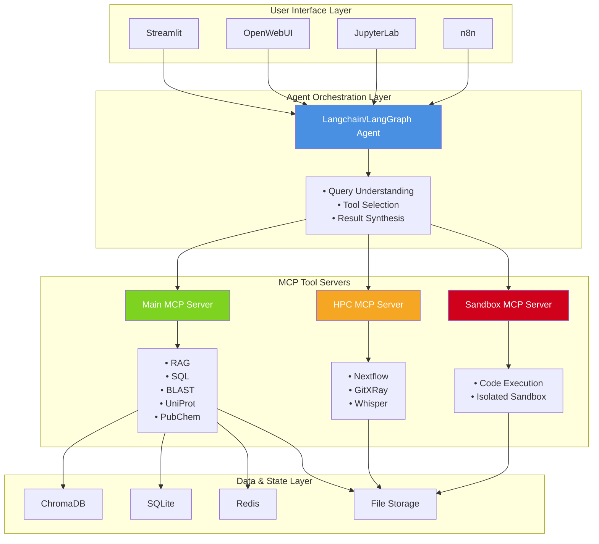

---

## Diagram 2: Query Flow - Behind the Scenes (Slide 16)

```mermaid
sequenceDiagram
    participant User
    participant Streamlit
    participant Agent as Langchain Agent
    participant MCP as MCP Server
    participant DB as Database

    User->>Streamlit: "Add note: Meeting at 3pm"
    Streamlit->>Agent: Forward query

    Note over Agent: Analyze query<br/>Select tool: notes_tool

    Agent->>MCP: POST /mcp/tools/notes_tool<br/>{"action": "add", "content": "Meeting at 3pm"}

    Note over MCP: Execute tool<br/>implementation

    MCP->>DB: INSERT INTO notes<br/>VALUES ('Meeting at 3pm')
    DB-->>MCP: note_id = 123

    MCP-->>Agent: {"status": "success", "note_id": 123}

    Note over Agent: Synthesize response<br/>using LLM

    Agent-->>Streamlit: "I've added your note: 'Meeting at 3pm'"
    Streamlit-->>User: Display response

    style Agent fill:#4A90E2,color:#fff
    style MCP fill:#7ED321,color:#fff
```

---

## Diagram 3: ReAct Agent Loop (Slide 21)

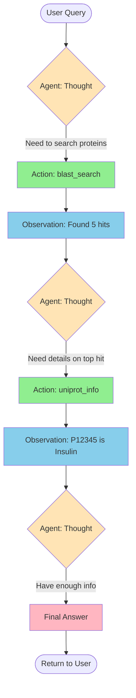

---

## Diagram 4: Single Agent vs Multi-Agent (Slide 22)

### Single Agent Architecture

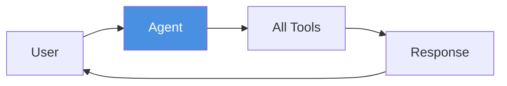

### Multi-Agent Architecture

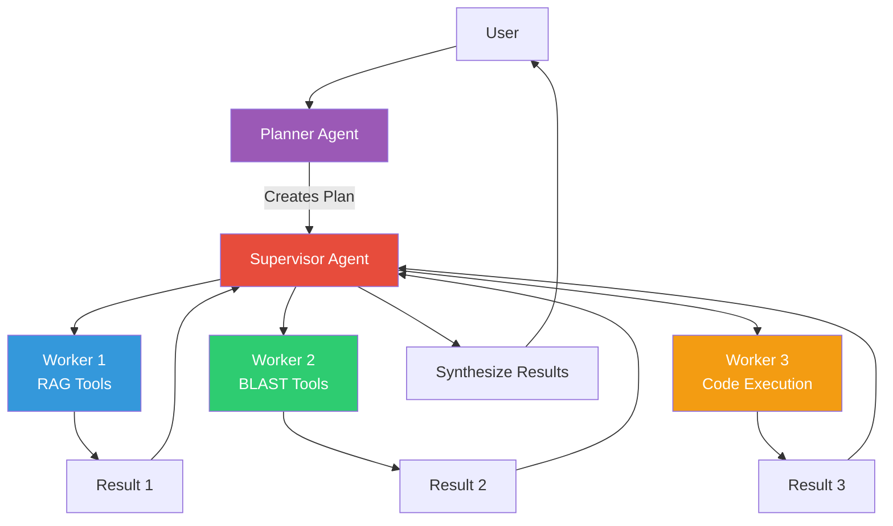

---

## Diagram 5: MCP Tool Registration Flow (Slide 17)

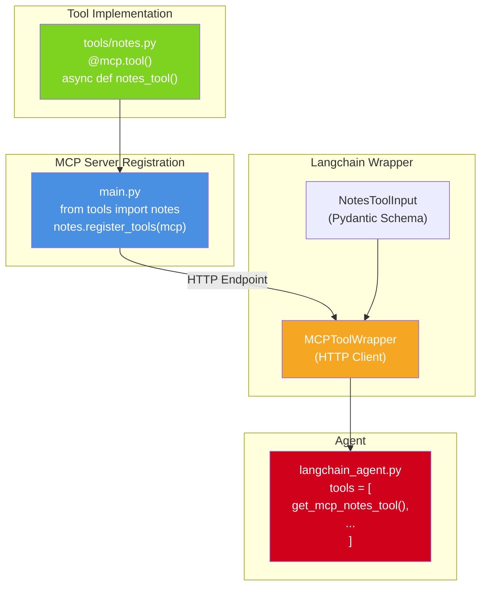

---

## Diagram 6: RAG Architecture (Slide 20)

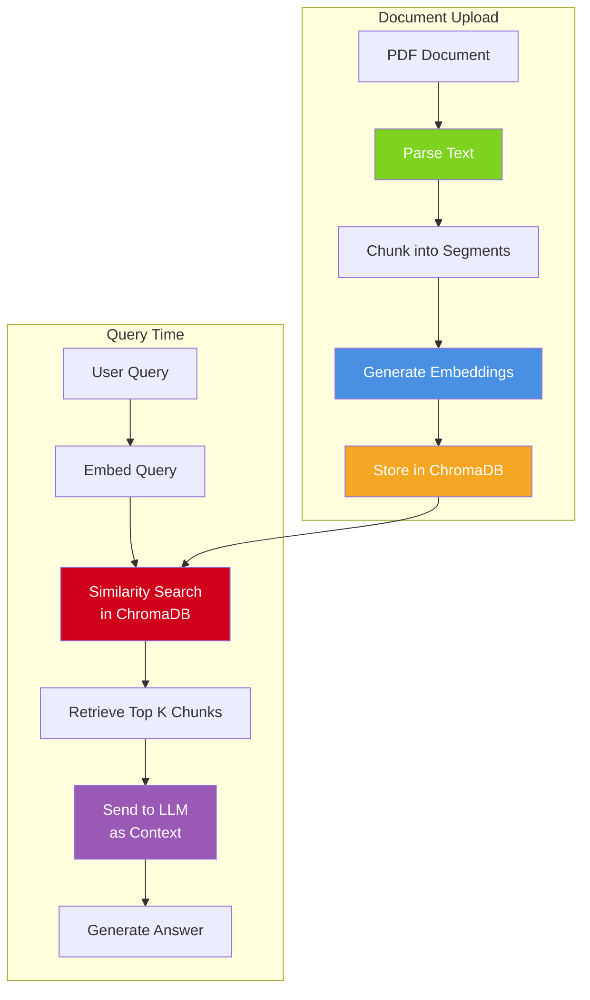

---

## Diagram 7: Chapter Progression (Slide 9)

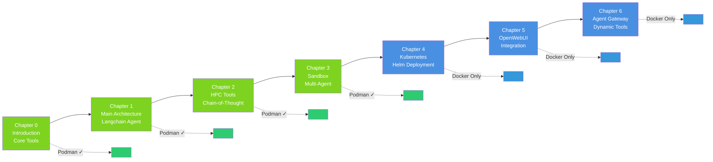

---

## Diagram 8: Deployment Options (Slide 31)

```mermaid
graph TB
    subgraph "Development"
        Dev[Single Server<br/>Docker Compose]
        Dev_Desc["• All services on one machine<br/>• Good for: Dev, demos<br/>• Chapters 0-3"]
    end

    subgraph "Enterprise"
        K8s[Kubernetes<br/>Helm Charts]
        K8s_Desc["• Scalable, HA<br/>• Good for: Production<br/>• Chapter 4"]
    end

    subgraph "Team Deployment"
        OpenWebUI[OpenWebUI<br/>Integration]
        OpenWebUI_Desc["• User management<br/>• Good for: Teams<br/>• Chapter 5"]
    end

    subgraph "Advanced"
        Gateway[Agent Gateway<br/>OpenAI API]
        Gateway_Desc["• Dynamic tools<br/>• Good for: Extensibility<br/>• Chapter 6"]
    end

    Dev --> Dev_Desc
    K8s --> K8s_Desc
    OpenWebUI --> OpenWebUI_Desc
    Gateway --> Gateway_Desc

    style Dev fill:#7ED321,color:#fff
    style K8s fill:#4A90E2,color:#fff
    style OpenWebUI fill:#F5A623,color:#fff
    style Gateway fill:#9B59B6,color:#fff
```

---

## Diagram 9: Container Status Check (Slide 13)

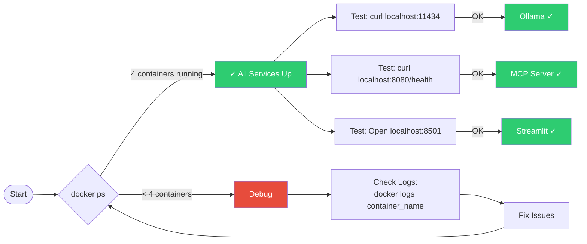

---

## Diagram 10: Scientific Workflow Example (Slide 23-26)

```mermaid
sequenceDiagram
    participant User
    participant Agent
    participant RAG as RAG Tool
    participant BLAST as BLAST Tool
    participant UniProt as UniProt Tool
    participant PubChem as PubChem Tool

    User->>Agent: "Analyze protein from my document,<br/>find similar sequences,<br/>suggest drug targets"

    Note over Agent: Step 1: Extract info from doc
    Agent->>RAG: Query document for protein sequence
    RAG-->>Agent: Found sequence: MKVLWA...

    Note over Agent: Step 2: Search for similar proteins
    Agent->>BLAST: Search sequence MKVLWA...
    BLAST-->>Agent: Top hit: P12345 (E-value: 1e-50)

    Note over Agent: Step 3: Get protein details
    Agent->>UniProt: Get info for P12345
    UniProt-->>Agent: P12345 = Insulin (Homo sapiens)

    Note over Agent: Step 4: Find drug targets
    Agent->>PubChem: Search compounds targeting insulin
    PubChem-->>Agent: Found 15 compounds

    Note over Agent: Synthesize results
    Agent-->>User: "Found Insulin protein<br/>15 potential drug compounds:<br/>1. Metformin (CID: 4091)<br/>2. Insulin glargine (CID: 5311281)<br/>..."

    style Agent fill:#4A90E2,color:#fff
```

---

## Diagram 11: LLM Provider Architecture (Slide 32)

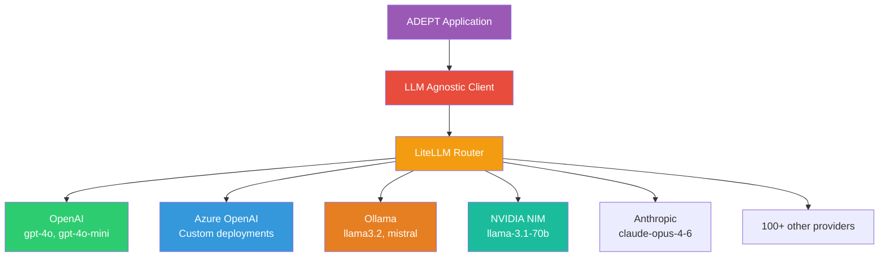

---

## Diagram 12: Testing Workflow (Slide 34)

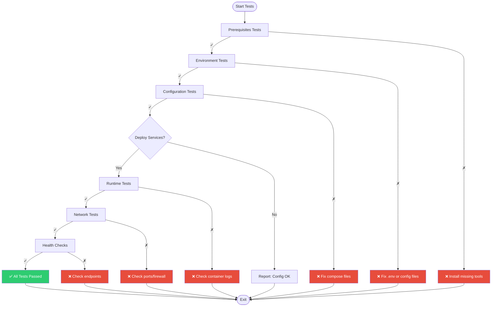

---

## Diagram 13: Workshop Timeline (For Facilitator)

```mermaid
gantt
    title 2-Hour Workshop Timeline
    dateFormat HH:mm
    axisFormat %H:%M

    section Setup
    Intro & Welcome           :done, 00:00, 10m
    Prerequisites Check       :done, 00:10, 5m

    section Architecture
    ADEPT Overview           :00:15, 10m
    Architecture Deep Dive   :00:25, 5m

    section Lab 1
    Deploy Chapter 0         :crit, 00:30, 15m
    Test & Verify            :00:45, 10m

    section Tools
    MCP Architecture         :00:55, 10m
    Agent Decision Making    :01:05, 10m

    section Lab 2
    RAG Upload               :crit, 01:15, 5m
    Scientific Workflow      :crit, 01:20, 15m

    section Advanced
    Advanced Features        :01:35, 10m
    Deployment Options       :01:45, 5m

    section Wrap-up
    Q&A                      :01:50, 10m
```

---

## Usage Examples

### Rendering Individual Diagrams

**Mermaid Live Editor:**
1. Go to https://mermaid.live/
2. Copy diagram code (including ```mermaid and ```)
3. Edit/customize
4. Click "Download PNG" or "Download SVG"

**Command Line:**
```bash
# Extract diagram to file
cat ADEPT-Workshop-Diagrams.md | \
  sed -n '/```mermaid/,/```/p' | \
  head -n -1 | tail -n +2 > diagram1.mmd

# Render
mmdc -i diagram1.mmd -o diagram1.png \
  -b transparent \
  -w 1920 \
  -H 1080
```

**Python Script:**
```python
import subprocess
import re

# Extract all diagrams from markdown
with open('ADEPT-Workshop-Diagrams.md', 'r') as f:
    content = f.read()

diagrams = re.findall(r'```mermaid\n(.*?)```', content, re.DOTALL)

for i, diagram in enumerate(diagrams):
    with open(f'diagram_{i+1}.mmd', 'w') as f:
        f.write(diagram)

    subprocess.run([
        'mmdc',
        '-i', f'diagram_{i+1}.mmd',
        '-o', f'diagram_{i+1}.png',
        '-b', 'transparent'
    ])
```

### Customization Options

**Color Themes:**
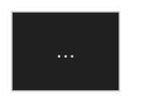

Available themes: default, dark, forest, neutral

**Custom Colors:**
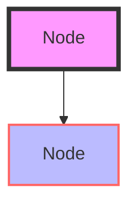

**Font Size:**
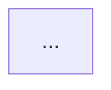

---

**End of Diagrams File**

These diagrams are ready to render and include in your workshop slides!
