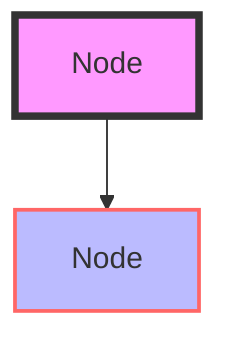
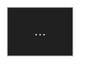

# ADEPT Workshop Materials

This directory contains complete materials for delivering a 2-hour ADEPT Framework workshop.

## Contents

- **ADEPT-Workshop-2Hour.md** - Complete workshop deck with 40+ slides, speaker notes, and facilitator guides
- **ADEPT-Workshop-Diagrams.md** - 13 Mermaid diagrams for key architectural concepts
- **render-diagrams.sh** - Bash script to render all diagrams (Linux/macOS)
- **render-diagrams.py** - Python script to render all diagrams (cross-platform)
- **package.json** - npm configuration for mermaid-cli installation
- **Makefile** - Convenience targets for common tasks

## Quick Start

### Option 1: Using Make (Recommended)

```bash
# Install mermaid-cli locally
make install

# Render all diagrams
make render

# View generated files
ls -lh diagrams/
```

### Option 2: Manual Installation

**Global installation (requires permissions):**
```bash
npm install -g @mermaid-js/mermaid-cli
./render-diagrams.sh
```

**Local installation:**
```bash
npm install
./render-diagrams.sh
```

**Using Python script:**
```bash
npm install  # or install mmdc globally
python3 render-diagrams.py
```

## Rendered Output

Diagrams are rendered to the `diagrams/` directory:

```
diagrams/
├── diagram_01.png  (Architecture Overview)
├── diagram_01.svg
├── diagram_02.png  (Query Flow Sequence)
├── diagram_02.svg
├── diagram_03.png  (ReAct Agent Loop)
├── diagram_03.svg
├── ...
└── diagram_13.svg  (Workshop Timeline)
```

**Formats:**
- **PNG:** High-resolution (1920x1080, 2x scale), transparent background
- **SVG:** Vector format, scalable, transparent background

## Diagram Index

| # | Diagram Name | Description | Use in Slide |
|---|--------------|-------------|--------------|
| 01 | Architecture Overview | Full system layers | Slide 7 |
| 02 | Query Flow Sequence | Behind-the-scenes tool execution | Slide 16 |
| 03 | ReAct Agent Loop | Thought/Action/Observation pattern | Slide 21 |
| 04 | Single vs Multi-Agent | Architecture comparison | Slide 22 |
| 05 | MCP Tool Registration | Implementation to agent flow | Slide 17 |
| 06 | RAG Architecture | Document upload and query flow | Slide 20 |
| 07 | Chapter Progression | 7 chapters with support status | Slide 9 |
| 08 | Deployment Options | Dev to production paths | Slide 31 |
| 09 | Container Status Check | Verification workflow | Slide 13 |
| 10 | Scientific Workflow | Multi-tool sequence example | Slide 23-26 |
| 11 | LLM Provider Architecture | LiteLLM routing | Slide 32 |
| 12 | Testing Workflow | Automated test suite flow | Slide 34 |
| 13 | Workshop Timeline | Gantt chart for facilitators | Facilitator Notes |

## Build Scripts

### render-diagrams.sh

Bash script for Linux/macOS systems.

**Features:**
- Extracts all Mermaid code blocks from markdown
- Renders both PNG and SVG formats
- Color-coded output with progress tracking
- Automatic cleanup of temporary files
- Detailed error reporting

**Usage:**
```bash
./render-diagrams.sh
```

**Requirements:**
- Bash 4.0+
- mermaid-cli (mmdc)
- awk, sed (standard Unix tools)

### render-diagrams.py

Python script for cross-platform compatibility (Linux/macOS/Windows).

**Features:**
- Same functionality as bash script
- Works on Windows without WSL
- More robust error handling
- Better path handling

**Usage:**
```bash
python3 render-diagrams.py
```

**Requirements:**
- Python 3.7+
- mermaid-cli (mmdc)
- No additional Python packages needed (uses stdlib only)

### Makefile

Convenience wrapper for common tasks.

**Targets:**
```bash
make install         # Install mermaid-cli locally
make install-global  # Install mermaid-cli globally
make render          # Render diagrams (bash script)
make render-python   # Render diagrams (Python script)
make clean           # Remove generated files
make clean-all       # Remove generated files + node_modules
make help            # Show help
```

## Workshop Delivery

### Preparation (1 Day Before)

1. **Render diagrams:**
   ```bash
   make install
   make render
   ```

2. **Review workshop deck:**
   - Read `ADEPT-Workshop-2Hour.md` completely
   - Note timing for each section
   - Prepare demo environment

3. **Test setup:**
   - Deploy Chapter 0 on demo machine
   - Test all commands in workshop
   - Verify URLs work

4. **Prepare materials:**
   - Export diagrams to presentation software
   - Print facilitator checklist (optional)
   - Share GitHub repo link with attendees

### Converting to Presentation Format

**Option 1: Marp (Markdown Presentations)**
```bash
# Install Marp CLI
npm install -g @marp-team/marp-cli

# Convert to HTML
marp ADEPT-Workshop-2Hour.md -o workshop-slides.html

# Convert to PDF
marp ADEPT-Workshop-2Hour.md -o workshop-slides.pdf --allow-local-files

# Convert to PowerPoint
marp ADEPT-Workshop-2Hour.md -o workshop-slides.pptx
```

**Option 2: reveal.js**
```bash
# Use pandoc to convert
pandoc ADEPT-Workshop-2Hour.md -t revealjs -s -o workshop-slides.html
```

**Option 3: Manual (PowerPoint/Google Slides)**
1. Open PowerPoint or Google Slides
2. Copy slide content from markdown
3. Insert rendered diagrams from `diagrams/` folder
4. Add speaker notes from markdown

### During Workshop

Follow the facilitator checklist in `ADEPT-Workshop-2Hour.md`:
- Section 1: Introduction & Setup (15 min)
- Section 2: Architecture Overview (15 min)
- Section 3: Hands-on Lab 1 (25 min)
- Section 4: MCP Tools & Agents (20 min)
- Section 5: Hands-on Lab 2 (20 min)
- Section 6: Advanced Features (15 min)
- Section 7: Q&A & Next Steps (10 min)

### After Workshop

1. Share materials with attendees
2. Collect feedback
3. Update workshop based on feedback
4. Contribute improvements back to repo

## Customization

### Modifying Diagrams

Edit `ADEPT-Workshop-Diagrams.md`:

1. Find the diagram you want to modify
2. Edit the Mermaid code between ` ```mermaid` and ` ``` `
3. Test online: https://mermaid.live/
4. Re-render: `make render`

**Example - Change colors:**


**Example - Change theme:**


Available themes: `default`, `dark`, `forest`, `neutral`

### Adding New Diagrams

1. Add diagram to `ADEPT-Workshop-Diagrams.md`:
   ```markdown
   ## Diagram 14: My New Diagram

   ```mermaid
   graph TD
       A[Start] --> B[End]
   ```
   ```

2. Re-render: `make render`
3. New diagram appears as `diagram_14.png` and `diagram_14.svg`

### Render Settings

To customize rendering, edit the scripts:

**In render-diagrams.sh:**
```bash
mmdc -i "$mmd_file" -o "$png_file" \
    -b transparent \        # Background color
    -w 1920 \               # Width
    -H 1080 \               # Height
    --scale 2               # Scale factor
```

**In render-diagrams.py:**
```python
[
    mmdc_path,
    '-i', str(temp_mmd),
    '-o', str(output_png),
    '-b', 'transparent',    # Background color
    '-w', '1920',          # Width
    '-H', '1080',          # Height
    '--scale', '2'         # Scale factor
]
```

**Available options:**
- `-b` / `--backgroundColor`: Background color (transparent, white, #RRGGBB)
- `-w` / `--width`: Width in pixels
- `-H` / `--height`: Height in pixels
- `--scale`: Scale factor (1-3)
- `-t` / `--theme`: Mermaid theme (default, dark, forest, neutral)

## Troubleshooting

### mmdc not found

**Error:**
```
Error: mermaid-cli (mmdc) not found
```

**Solution:**
```bash
# Install globally
npm install -g @mermaid-js/mermaid-cli

# Or install locally
npm install
export PATH="$PATH:$(pwd)/node_modules/.bin"
```

### Diagram rendering fails

**Error:**
```
Rendering diagram XX... ✗ Failed
```

**Solution:**
1. Check Mermaid syntax: https://mermaid.live/
2. Ensure node_modules/.bin/mmdc is executable
3. Try rendering single diagram manually:
   ```bash
   mmdc -i test.mmd -o test.png
   ```

### Python script import error

**Error:**
```
ModuleNotFoundError: No module named 'X'
```

**Solution:**
The Python script uses only standard library. Ensure Python 3.7+:
```bash
python3 --version
```

### Permission denied

**Error:**
```
bash: ./render-diagrams.sh: Permission denied
```

**Solution:**
```bash
chmod +x render-diagrams.sh render-diagrams.py
```

## CI/CD Integration

### GitHub Actions

```yaml
name: Render Workshop Diagrams

on:
  push:
    paths:
      - 'docs/workshop/ADEPT-Workshop-Diagrams.md'

jobs:
  render:
    runs-on: ubuntu-latest
    steps:
      - uses: actions/checkout@v3

      - name: Setup Node.js
        uses: actions/setup-node@v3
        with:
          node-version: '18'

      - name: Install dependencies
        working-directory: docs/workshop
        run: npm install

      - name: Render diagrams
        working-directory: docs/workshop
        run: npm run render:python

      - name: Commit diagrams
        run: |
          git config user.name "GitHub Actions"
          git config user.email "actions@github.com"
          git add docs/workshop/diagrams/
          git commit -m "Auto-render workshop diagrams" || exit 0
          git push
```

### GitLab CI

```yaml
render-diagrams:
  image: node:18
  script:
    - cd docs/workshop
    - npm install
    - npm run render:python
  artifacts:
    paths:
      - docs/workshop/diagrams/
  only:
    changes:
      - docs/workshop/ADEPT-Workshop-Diagrams.md
```

## Resources

**Mermaid Documentation:**
- Official Docs: https://mermaid.js.org/
- Live Editor: https://mermaid.live/
- CLI Docs: https://github.com/mermaid-js/mermaid-cli

**ADEPT Resources:**
- Main Tutorial: `../agentic-framework-tutorial.md`
- Tool Guide: `../agentic-framework-tool-user-guide.md`
- Podman Guide: `../PODMAN_QUICKSTART.md`

**Workshop Materials:**
- Complete Deck: `ADEPT-Workshop-2Hour.md`
- All Diagrams: `ADEPT-Workshop-Diagrams.md`

## Contributing

Improvements to workshop materials are welcome!

**To contribute:**
1. Edit workshop markdown files
2. Test diagram rendering: `make render`
3. Review output in `diagrams/` folder
4. Submit pull request with changes

**Areas for contribution:**
- Additional diagrams
- Workshop timing improvements
- Alternative deployment examples
- Troubleshooting guides
- Translations

## License

See [../../LICENSE](../../LICENSE) for license information.

---

**Last Updated:** 2026-02-09
**Workshop Version:** 1.0
**Tested with:** mermaid-cli 11.4.1, Node.js 18+, Python 3.11+
